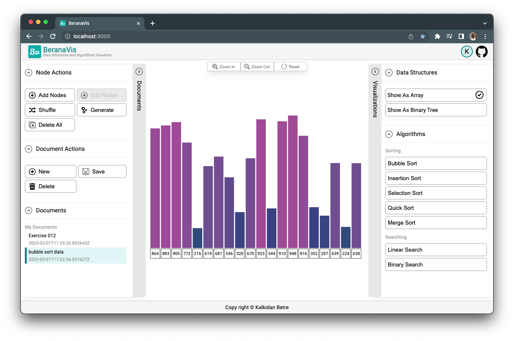

[![Contributors][contributors-shield]][contributors-url]
[![Forks][forks-shield]][forks-url]
[![Stargazers][stars-shield]][stars-url]
[![Issues][issues-shield]][issues-url]
[![MIT License][license-shield]][license-url]
[![LinkedIn][linkedin-shield]][linkedin-url]

<!-- PROJECT LOGO -->
<br />
<div align="center">
  <a href="https://github.com/kalibetre/berana-viz">
    
  </a>

  <h3 align="center">BeranaViz</h3></h3>

  <p align="center">
    A data structures and algorithms visualizer
    <br />
    <br />
    <br />
    <a href="https://beranaviz.netlify.app/">View Demo</a>
    ·
    <a href="https://github.com/kalibetre/berana-viz/issues">Report Bug</a>
    ·
    <a href="https://github.com/kalibetre/berana-viz/issues">Request Feature</a>
  </p>
</div>

## About The Project



BeranaViz is a data structures and algorithms visualization that can help you quickly learn data structures and algorithms concepts through animation that you can control. This app allows you to see every step made by a search or sorting algorithm.

In addition, you can also save your documents by creating an account so that you wont lose your data.

### Built With

[![React][react.js]][react-url]

This project is the front end part of BeranaViz web app and is built with ReactJs. For state management, Redux is used. Furthermore, to authenticate with the backend api, it uses Firebase.

## Getting Started

To get a local copy up and running follow these simple example steps.

### Installation

1. Clone the repo
    ```sh
    git clone https://github.com/kalibetre/berana-viz.git
    ```
2. Install NPM packages
    ```sh
    npm install
    ```
3. Head over to Firebase, create a project and obtain a service account key
4. Setup Environment variables
    ```sh
    REACT_APP_API_KEY=
    REACT_APP_AUTH_DOMAIN=
    REACT_APP_PROJECT_ID=
    REACT_APP_STORAGE_BUCKET=
    REACT_APP_MESSAGING_SENDER_ID=
    REACT_APP_APP_ID=
    REACT_APP_MEASUREMENT_ID=
    ```
5. Setup and run the backend api (berana-viz-api) and set the API_URL env variable (see below example)
    ```sh
    REACT_APP_API_URL=http://127.0.0.1:8000/api/v1/
    ```
6. Start the project
    ```sh
    npm start
    ```

## Roadmap

-   [ ] Add more data structure visualizations
-   [ ] Add more sorting and searching algorithms
-   [ ] Prepare a full app documentation for contributors
-   [ ] Multi-language Support
    -   [ ] Amharic

See the [open issues](https://github.com/kalibetre/berana-viz/issues) for a full list of proposed features (and known issues).

## Contributing

Contributions are what make the open source community such an amazing place to learn, inspire, and create. Any contributions you make are **greatly appreciated**.

If you have a suggestion that would make this better, please fork the repo and create a pull request. You can also simply open an issue with the tag "enhancement".
Don't forget to give the project a star! Thanks again!

1. Fork the Project
2. Create your Feature Branch (`git checkout -b feature/AmazingFeature`)
3. Commit your Changes (`git commit -m 'Add some AmazingFeature'`)
4. Push to the Branch (`git push origin feature/AmazingFeature`)
5. Open a Pull Request

## License

Distributed under the MIT License. See `LICENSE.txt` for more information.

<!-- CONTACT -->

## Contact

Kalkidan Betre - [@kalibetre](https://twitter.com/kalibetre) - kalbetre@icloud.com

Project Link: [https://github.com/kalibetre/berana-viz](https://github.com/kalibetre/berana-viz)

[contributors-shield]: https://img.shields.io/github/contributors/kalibetre/berana-viz.svg?style=for-the-badge
[contributors-url]: https://github.com/kalibetre/berana-viz/graphs/contributors
[forks-shield]: https://img.shields.io/github/forks/kalibetre/berana-viz.svg?style=for-the-badge
[forks-url]: https://github.com/kalibetre/berana-viz/forks
[stars-shield]: https://img.shields.io/github/stars/kalibetre/berana-viz.svg?style=for-the-badge
[stars-url]: https://github.com/kalibetre/berana-viz/stargazers
[issues-shield]: https://img.shields.io/github/issues/kalibetre/berana-viz.svg?style=for-the-badge
[issues-url]: https://github.com/kalibetre/berana-viz/issues
[license-shield]: https://img.shields.io/github/license/kalibetre/berana-viz.svg?style=for-the-badge
[license-url]: https://github.com/kalibetre/berana-viz/blob/main/LICENSE
[linkedin-shield]: https://img.shields.io/badge/-LinkedIn-black.svg?style=for-the-badge&logo=linkedin&colorB=555
[linkedin-url]: https://www.linkedin.com/in/kalkidan-betre-405750110
[product-screenshot]: images/screenshot.png
[react.js]: https://img.shields.io/badge/React-20232A?style=for-the-badge&logo=react&logoColor=61DAFB
[react-url]: https://reactjs.org/
